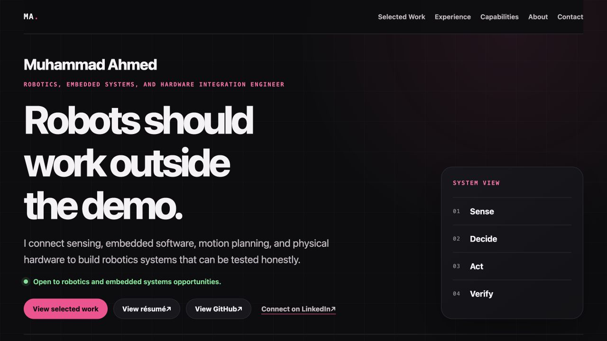

# Muhammad Ahmed | Robotics and Embedded Systems Portfolio

[](https://ahmedshaikh77.github.io/Muhammad-Ahmed-Portfolio/)

## Live portfolio

Visit [ahmedshaikh77.github.io/Muhammad-Ahmed-Portfolio](https://ahmedshaikh77.github.io/Muhammad-Ahmed-Portfolio/).

## Purpose

This portfolio presents selected robotics and embedded systems work through evidence, implementation boundaries, and personal contribution. It focuses on ROS 2 manipulation, embedded sensing, edge perception, and hardware-software integration.

## Selected features

- Evidence-first case studies with repository-sourced media
- Recruiter-ready Resume access above the fold
- Direct 30-minute meeting booking through Calendly
- Accurate project status and validation boundaries
- Responsive layouts for mobile, tablet, and desktop
- Keyboard-operable navigation and reduced-motion support
- Open Graph, Twitter card, JSON-LD, favicon, and sitemap metadata
- Plain HTML, CSS, and JavaScript with no build step

## Repository structure

```text
.
|-- index.html
|-- sitemap.xml
|-- assets/
|   |-- css/styles.css
|   |-- js/main.js
|   |-- icons/favicon.svg
|   |-- resume/Muhammad-Ahmed.pdf
|   `-- images/
|       |-- portfolio-preview.png
|       |-- social-preview.png
|       `-- projects/
`-- tests/site.test.mjs
```

## Local preview

From the repository root, run:

```bash
python3 -m http.server 4173
```

Then open `http://localhost:4173/`.

Run the dependency-free checks with:

```bash
node --test tests/site.test.mjs
```

## GitHub Pages deployment

The site is published from the repository's `main` branch through GitHub Pages. After a tested change is merged into `main`, verify that the live revision matches the commit and that all project media resolves from the published URL.

## Accessibility and performance

The site uses semantic landmarks and heading order, a skip link, visible keyboard focus, 44-pixel mobile targets, reduced-motion styles, explicit image dimensions, local system fonts, and progressive enhancement. Core content stays visible if JavaScript is unavailable.

## Media provenance

- `kinova-ball-mid-air.jpeg` and `kinova-wind-up.jpeg`: copied from `Ahmedshaikh77/KinovaGen3-Beer-Pong` under `docs/`.
- `kinova-stack-gazebo.png` and `kinova-stack-rviz.png`: copied from `Ahmedshaikh77/kinovaGen3-Pick-and-Place` under `docs/`.
- `neurobot.png`: user-provided photograph of the physical NeuroBot prototype.
- `crutch-prototype.jpeg`: downloaded from the prototype image linked in the `Ahmedshaikh77/Comfortable-Responsive-Universal-Technology-for-Crutch-Health-CRUTCH` README at `https://github.com/user-attachments/assets/b7e089eb-321b-4cbf-8a11-7d43467a3301`.
- `armbot-cad.png`: copied from `Ahmedshaikh77/6DOF-Robot` under `docs/`.
- `social-preview.png`: portfolio identity graphic created for this site.
- `portfolio-preview.png`: screenshot of the finished local portfolio.
- `Muhammad-Ahmed.pdf`: user-provided public resume linked from the portfolio.

Repository media is used to show the documented project context. An image alone is not presented as proof of performance, ownership of every pictured component, clinical validation, or production readiness.

## Authorship

Designed, written, and maintained by Muhammad Ahmed.
