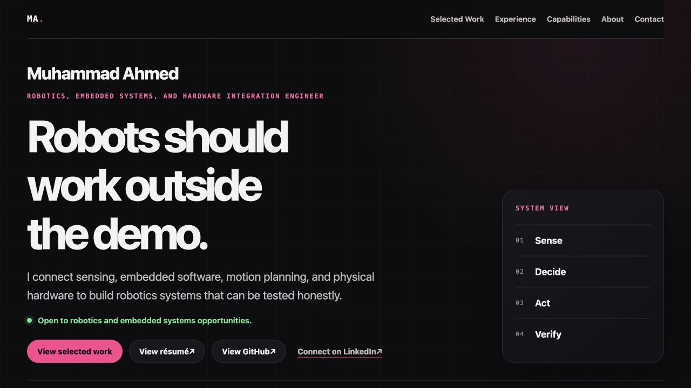

# Muhammad Ahmed | Robotics and Embedded Systems Portfolio

[](https://ahmedshaikh77.github.io/Muhammad-Ahmed-Portfolio/)

## Live portfolio

Visit [ahmedshaikh77.github.io/Muhammad-Ahmed-Portfolio](https://ahmedshaikh77.github.io/Muhammad-Ahmed-Portfolio/).

## Purpose

This portfolio presents selected robotics and embedded systems work through evidence, implementation boundaries, and personal contribution. It focuses on ROS 2 manipulation, embedded sensing, edge perception, and hardware-software integration.

## Selected features

- Evidence-first case studies organized as Outcome, What I built, and Proof, with repository-sourced media
- Recruiter-ready Resume access above the fold
- “Schedule a meeting” booking action through Calendly and an “Email” link to the Duke email address
- About, education, and published research before the project case studies
- Grouped technical skills and source-linked recognition
- Owner-approved Agentic AI & Intelligent Automation skills covering LLM workflows, AI-assisted development, workflow automation, and bot development
- Desktop radar cursor, with animated circuit traces and a robotics signal-flow illustration on desktop and mobile
- Accurate project status and validation boundaries
- Responsive layouts for mobile, tablet, and desktop
- Keyboard-operable navigation and reduced-motion support
- Open Graph, Twitter card, JSON-LD, favicon, and sitemap metadata
- Plain HTML, CSS, and JavaScript with no build step

## Repository structure

```text
.
|-- index.html
|-- sitemap.xml
|-- assets/
|   |-- css/styles.css
|   |-- css/effects.css
|   |-- js/main.js
|   |-- js/effects.js
|   |-- icons/favicon.svg
|   |-- resume/Muhammad-Ahmed.pdf
|   `-- images/
|       |-- portfolio-preview.png
|       |-- social-preview.png
|       `-- projects/
`-- tests/
    |-- site.test.mjs
    |-- effects.test.mjs
    `-- fixtures/no-js.html
```

## Local preview

From the repository root, run:

```bash
python3 -m http.server 4173
```

Then open `http://localhost:4173/`.

Run the dependency-free checks with:

```bash
node --test tests/*.test.mjs
```

## GitHub Pages deployment

The site is published from the repository's `main` branch through GitHub Pages. After a tested change is merged into `main`, verify that the live revision matches the commit and that all project media resolves from the published URL.

## Accessibility and performance

The site uses semantic landmarks and heading order, a skip link, visible keyboard focus, 44-pixel mobile targets, reduced-motion styles, explicit image dimensions, local system fonts, and progressive enhancement. Core content stays visible if JavaScript is unavailable.

On supported desktop layouts, the radar replaces the native pointer while it is active and never blocks interaction. The native pointer returns whenever the effect is paused, hidden, or unavailable. Pink circuit traces sit beside the introduction copy; a signal packet follows Sensors → Controller → Motors → Feedback while Sense / Decide / Act / Verify highlights advance together. This is an illustrative control loop, not live telemetry or a claim about project performance.

One elapsed-time animation loop is capped at 24 paints per second and a pixel density of 2. It stops when the introduction is offscreen or the tab is hidden. “Pause animations” / “Play animations” preserves the current signal position and works on touchscreens. Phones and tablets animate the same signal loop, with two background circuit paths restricted to the card area on stacked layouts. Touch input never stops the signal animation; only the radar cursor requires a wide layout and a fine, hovering pointer. Reduced-motion preferences retain a static schematic. Core content and the schematic remain available without JavaScript.

## Content sources

Skills draw from the supplied public resume, the previous portfolio, and the owner's LinkedIn project descriptions. They are grouped by discipline without invented proficiency scores. Research performance claims remain subject to the project evidence boundaries.

The Agentic AI & Intelligent Automation card uses the owner's approved description of applied AI-agent use and custom tool/bot development. It does not claim model training, production-scale autonomous systems, or development of every underlying agent platform.

The medical robotics education entry records a Duke University graduate certificate.

The recognition section records six distinct screenshot-supported entries: the Duke Outstanding Master’s Poster Award, Dean’s Research Award for Master’s Students, Innovation Co-Lab Grant, SRMIST Best Project BTech Mechanical 2022-2023, Best Research Award in Research Day 2023, and Industrial Tribology workshop recognition. Every card links to the owner's LinkedIn Honors &amp; Awards page. No award amount, selectivity, or unsupported project association is inferred.

## Media provenance

- `kinova-ball-mid-air.jpeg` and `kinova-wind-up.jpeg`: copied from `Ahmedshaikh77/KinovaGen3-Beer-Pong` under `docs/`.
- `kinova-stack-gazebo.png` and `kinova-stack-rviz.png`: copied from `Ahmedshaikh77/kinovaGen3-Pick-and-Place` under `docs/`.
- `neurobot.jpg`: web-optimized version of the user-provided physical NeuroBot prototype photograph.
- `crutch-prototype.jpeg`: downloaded from the prototype image linked in the `Ahmedshaikh77/Comfortable-Responsive-Universal-Technology-for-Crutch-Health-CRUTCH` README at `https://github.com/user-attachments/assets/b7e089eb-321b-4cbf-8a11-7d43467a3301`.
- `armbot-cad.png`: copied from `Ahmedshaikh77/6DOF-Robot` under `docs/`.
- `social-preview.png`: portfolio identity graphic created for this site.
- `portfolio-preview.png`: screenshot of the finished local portfolio.
- `Muhammad-Ahmed.pdf`: user-provided public resume linked from the portfolio.

Repository media is used to show the documented project context. An image alone is not presented as proof of performance, ownership of every pictured component, clinical validation, or production readiness.

## Authorship

Designed, written, and maintained by Muhammad Ahmed.
